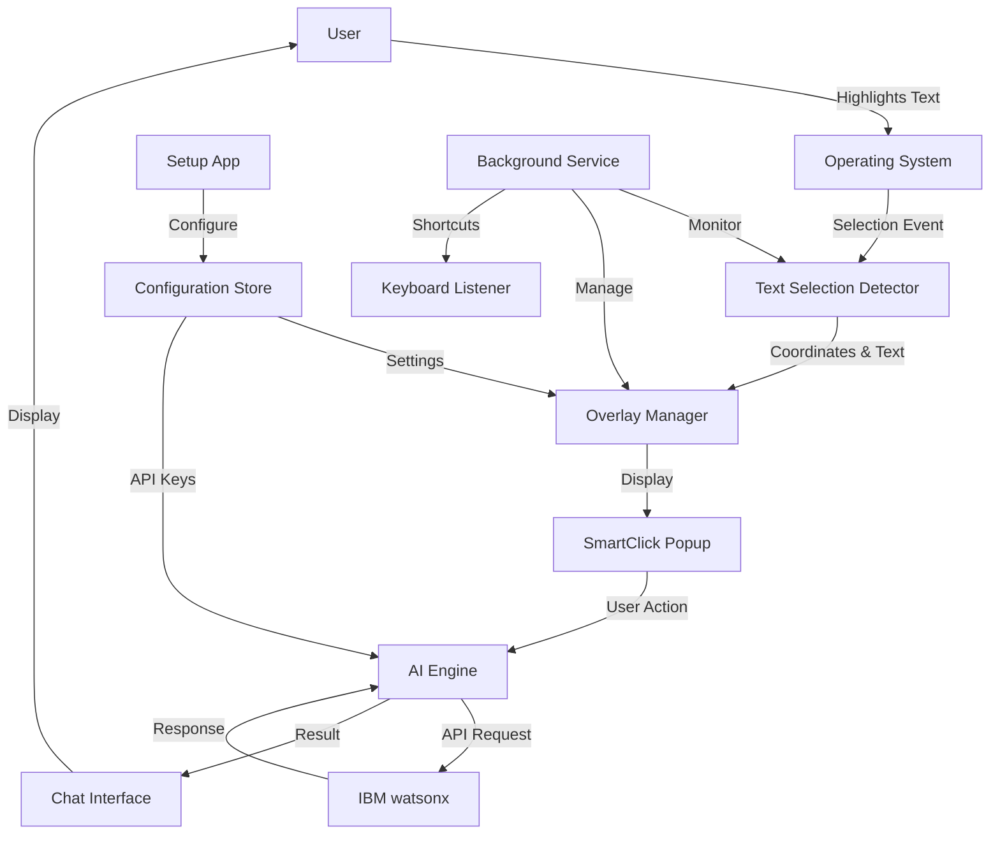
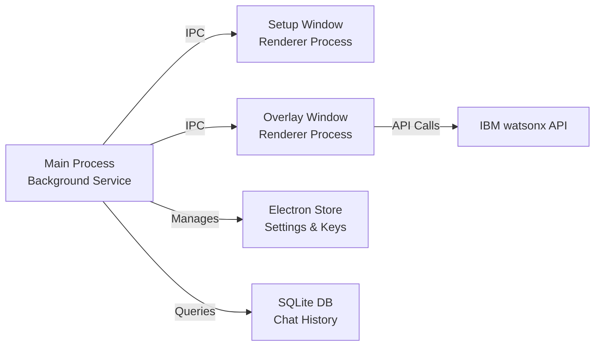
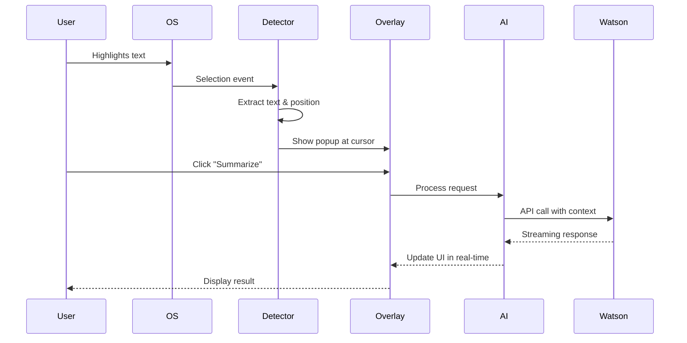

# SmartClick Architecture Documentation

## Executive Summary

SmartClick is a cross-platform AI-powered cursor layer that integrates IBM Bob/watsonx AI into any application. The system consists of two main components:

1. **Setup/Configuration App** - One-time setup interface that runs in the background
2. **Cursor Layer** - System-wide text selection overlay with AI capabilities

## Technology Stack Recommendations

### Core Framework: Electron + Node.js

**Rationale:**
- **Cross-platform compatibility** - Single codebase for Windows, macOS, and Linux
- **System-level access** - Can create global overlays and capture system-wide events
- **Rich UI capabilities** - Modern web technologies for responsive, beautiful interfaces
- **Active ecosystem** - Extensive libraries for system integration
- **IBM SDK support** - Node.js has official IBM watsonx SDK

### Technology Breakdown

#### 1. Setup/Configuration App
- **Framework:** Electron
- **UI:** React 18+ with TypeScript
- **State Management:** Zustand (lightweight, perfect for settings)
- **Styling:** Tailwind CSS + shadcn/ui components
- **Build Tool:** Vite (fast development, optimized builds)

#### 2. Cursor Layer (Overlay System)
- **Framework:** Electron (transparent, frameless windows)
- **UI:** React 18+ with TypeScript
- **Overlay Management:** Custom Electron BrowserWindow configuration
- **Text Selection Detection:** Native OS APIs via Node.js addons
- **IPC:** Electron IPC for communication between processes

#### 3. Background Service
- **Runtime:** Node.js
- **Process Management:** Electron main process
- **System Integration:** 
  - `node-global-key-listener` for keyboard shortcuts
  - `robotjs` or `nut-js` for cursor position tracking
  - Native modules for clipboard and text selection access

#### 4. AI Integration
- **IBM watsonx SDK:** `@ibm-cloud/watsonx-ai`
- **HTTP Client:** `axios` with retry logic
- **Streaming:** Server-Sent Events (SSE) for real-time responses
- **Context Management:** Custom context window manager

#### 5. Data & Storage
- **Settings Storage:** `electron-store` (encrypted local storage)
- **Chat History:** SQLite via `better-sqlite3`
- **Cache:** In-memory LRU cache for recent contexts

### Alternative Stack Consideration

**Tauri + Rust** (Future consideration)
- Lighter weight than Electron
- Better performance and security
- Smaller bundle size
- More complex development for system-level features
- **Recommendation:** Start with Electron, consider Tauri for v2.0

## System Architecture

### High-Level Component Diagram



### Process Architecture



### Data Flow: Text Selection to AI Response



## Core Features & Implementation

### 1. Text Selection Detection

**Cross-Platform Approaches:**

**Windows:**
- Use Windows Accessibility API (UI Automation)
- Monitor clipboard for Ctrl+C events
- Hook into text selection events via native addon

**macOS:**
- Use Accessibility API (AXUIElement)
- Monitor NSPasteboard
- Require accessibility permissions

**Linux:**
- Use X11 selection buffer (PRIMARY selection)
- Monitor D-Bus for clipboard events
- Wayland support via wl-clipboard

**Implementation Strategy:**
```typescript
// Unified text selection interface
interface TextSelection {
  text: string;
  position: { x: number; y: number };
  application: string;
  timestamp: number;
}

class TextSelectionDetector {
  private platform: 'win32' | 'darwin' | 'linux';
  
  async detectSelection(): Promise<TextSelection | null> {
    switch (this.platform) {
      case 'win32':
        return this.detectWindows();
      case 'darwin':
        return this.detectMacOS();
      case 'linux':
        return this.detectLinux();
    }
  }
}
```

### 2. Overlay System

**Electron Window Configuration:**
```typescript
const overlayWindow = new BrowserWindow({
  transparent: true,
  frame: false,
  alwaysOnTop: true,
  skipTaskbar: true,
  resizable: false,
  focusable: true,
  webPreferences: {
    nodeIntegration: false,
    contextIsolation: true,
    preload: path.join(__dirname, 'preload.js')
  }
});

// Make window click-through except for popup area
overlayWindow.setIgnoreMouseEvents(true, { forward: true });
```

**Popup Positioning:**
- Calculate position relative to text selection
- Adjust for screen boundaries
- Handle multi-monitor setups
- Smooth animations with CSS transitions

### 3. IBM watsonx Integration

**API Configuration:**
```typescript
interface WatsonxConfig {
  apiKey: string;
  projectId: string;
  endpoint: string;
  modelId: string; // e.g., 'ibm/granite-13b-chat-v2'
}

class WatsonxClient {
  async generateText(prompt: string, context: string): Promise<string> {
    // Use IBM watsonx SDK
    const response = await this.client.textGeneration({
      input: this.buildPrompt(prompt, context),
      modelId: this.config.modelId,
      parameters: {
        max_new_tokens: 1024,
        temperature: 0.7,
        top_p: 0.9
      }
    });
    return response.results[0].generated_text;
  }
  
  async streamGeneration(prompt: string, context: string): AsyncGenerator<string> {
    // Streaming implementation for real-time responses
  }
}
```

**Prompt Templates:**
```typescript
const PROMPT_TEMPLATES = {
  summarize: "Summarize the following text concisely:\n\n{context}",
  rewrite: "Rewrite the following text to be more {tone}:\n\n{context}",
  explain: "Explain the following text in simple terms:\n\n{context}",
  analyze: "Analyze the following text and provide insights:\n\n{context}",
  custom: "{prompt}\n\nContext:\n{context}"
};
```

### 4. Context Management

**Context Window Strategy:**
```typescript
interface ConversationContext {
  id: string;
  selectedText: string;
  messages: Message[];
  metadata: {
    application: string;
    timestamp: number;
    location: string;
  };
}

class ContextManager {
  private maxContextLength = 4096; // tokens
  
  buildContext(conversation: ConversationContext): string {
    // Implement sliding window with selected text always included
    // Prioritize recent messages
    // Truncate older messages if needed
  }
}
```

## Security Considerations

### 1. API Key Storage
- Store IBM watsonx credentials in encrypted format
- Use `electron-store` with encryption enabled
- Never expose keys in renderer process
- Implement key rotation mechanism

### 2. Data Privacy
- All text processing happens locally until sent to IBM
- Implement opt-in telemetry
- Clear chat history option
- No persistent storage of sensitive text without consent

### 3. Permissions
- Request only necessary OS permissions
- Clear permission explanations in setup
- Graceful degradation if permissions denied

## Performance Optimization

### 1. Overlay Performance
- Use CSS transforms for animations (GPU-accelerated)
- Lazy load chat interface components
- Debounce text selection events (300ms)
- Virtual scrolling for long chat histories

### 2. AI Response Optimization
- Implement response caching for identical queries
- Use streaming for better perceived performance
- Show loading states immediately
- Prefetch common operations

### 3. Memory Management
- Limit chat history in memory (last 50 conversations)
- Implement garbage collection for old contexts
- Use worker threads for heavy processing
- Monitor and limit overlay window count

## Accessibility

- Full keyboard navigation support
- Screen reader compatibility
- High contrast mode support
- Customizable font sizes
- Respect OS accessibility settings

## Deployment Strategy

### Build & Distribution
- **Electron Builder** for packaging
- **Auto-update** via electron-updater
- **Code signing** for all platforms
- **DMG** for macOS, **MSI** for Windows, **AppImage/deb** for Linux

### Installation Flow
1. User downloads installer
2. Setup app launches automatically
3. User configures IBM watsonx credentials
4. User sets keyboard shortcuts
5. User grants necessary permissions
6. Setup app minimizes to system tray
7. Background service starts monitoring

## Monitoring & Analytics

- Error tracking with Sentry
- Anonymous usage analytics (opt-in)
- Performance metrics
- API usage tracking
- Crash reporting

## Future Enhancements (Post-MVP)

1. **Multi-AI Provider Support** - OpenAI, Anthropic, local models
2. **Custom Actions** - User-defined text transformations
3. **Team Collaboration** - Shared prompts and templates
4. **Browser Extension** - Enhanced web integration
5. **Mobile Companion** - iOS/Android apps
6. **Voice Input** - Speech-to-text for queries
7. **Plugin System** - Third-party extensions
8. **Offline Mode** - Local AI model support

## Technical Risks & Mitigations

| Risk | Impact | Mitigation |
|------|--------|------------|
| OS-specific text selection APIs vary | High | Abstract with unified interface, extensive testing |
| Overlay performance on older hardware | Medium | Implement performance monitoring, graceful degradation |
| IBM watsonx API rate limits | Medium | Implement request queuing, caching, user feedback |
| Permission denial by users | High | Clear explanations, graceful fallbacks, manual mode |
| Electron bundle size | Low | Code splitting, lazy loading, tree shaking |

## Development Environment Setup

### Prerequisites
- Node.js 18+ LTS
- npm or yarn
- Git
- Platform-specific build tools:
  - Windows: Visual Studio Build Tools
  - macOS: Xcode Command Line Tools
  - Linux: build-essential

### Quick Start
```bash
npm install
npm run dev          # Start development mode
npm run build        # Build for production
npm run package      # Create distributable
```

## Conclusion

This architecture provides a solid foundation for SmartClick with:
- ✅ Cross-platform compatibility
- ✅ System-wide text selection
- ✅ Seamless IBM watsonx integration
- ✅ Scalable and maintainable codebase
- ✅ Excellent user experience
- ✅ Security and privacy by design

The Electron + React + TypeScript stack offers the best balance of development speed, cross-platform support, and rich UI capabilities for this use case.