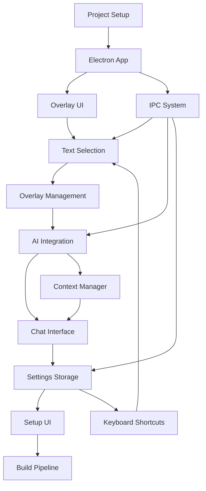

# SmartClick Implementation Priority Guide

## Quick Reference

This guide provides a prioritized list of files to create and implement, organized by urgency and dependencies. Use this as your roadmap for building SmartClick efficiently.

## Priority Levels

- 🔴 **Critical** - Must have for MVP, blocks other work
- 🟡 **High** - Important for core functionality
- 🟢 **Medium** - Enhances user experience
- 🔵 **Low** - Nice to have, can be deferred

---

## Phase 0: MVP Prototype (Week 1 - 5 Days)

**Goal**: Demonstrate core concept with minimal features

### Day 1: Project Foundation 🔴

```
1. package.json (update with dependencies)
2. tsconfig.json (base TypeScript config)
3. tsconfig.main.json (main process config)
4. tsconfig.renderer.json (renderer process config)
5. vite.config.ts (Vite bundler config)
6. electron-builder.yml (packaging config)
7. .env.example (environment template)
8. .gitignore (Git ignore rules)
```

**Commands to run:**
```bash
npm init -y
npm install electron electron-builder vite typescript
npm install react react-dom
npm install -D @types/react @types/react-dom @types/node
npm install -D @vitejs/plugin-react
```

### Day 2: Basic Electron App 🔴

```
9. src/main/index.ts (main entry point)
10. src/main/app.ts (app lifecycle)
11. src/main/utils/logger.ts (logging utility)
12. src/preload/overlay.preload.ts (preload script)
13. scripts/dev.js (development script)
```

**Test**: App should launch with a blank window

### Day 3: Simple Overlay UI 🔴

```
14. src/renderer/overlay/index.html
15. src/renderer/overlay/main.tsx
16. src/renderer/overlay/App.tsx
17. src/renderer/overlay/components/Popup/index.tsx
18. src/renderer/overlay/styles/overlay.css
19. src/shared/types/index.ts
```

**Test**: Overlay window appears on screen

### Day 4: Text Selection (Clipboard-based) 🔴

```
20. src/main/services/text-selection/detector.ts
21. src/main/ipc/overlay.handler.ts
22. src/shared/types/selection.types.ts
23. src/renderer/overlay/hooks/useSelection.ts
```

**Test**: Copying text triggers popup

### Day 5: Mock AI Response 🔴

```
24. src/main/services/ai/watsonx-client.ts (with mock)
25. src/renderer/overlay/hooks/useAI.ts
26. src/renderer/overlay/components/Popup/ActionButtons.tsx
27. src/shared/constants/prompts.ts
```

**Test**: Clicking "Summarize" shows mock response

**MVP Deliverable**: Working prototype demonstrating text selection → popup → mock AI response

---

## Phase 1: Core Infrastructure (Week 1-2)

### Week 1, Day 1-2: Complete Electron Setup 🔴

```
28. src/main/ipc/index.ts (IPC router)
29. src/main/utils/error-handler.ts
30. src/main/utils/platform.ts
31. src/main/types/index.ts
32. src/main/types/ipc.types.ts
33. vitest.config.ts (test config)
34. .eslintrc.json (linting config)
35. .prettierrc (formatting config)
```

### Week 1, Day 3-4: Build Pipeline 🟡

```
36. scripts/build.js
37. scripts/package.js
38. scripts/clean.js
39. .github/workflows/build.yml (CI/CD)
40. build/entitlements.mac.plist
```

### Week 1, Day 5: Testing Setup 🟡

```
41. tests/helpers/test-utils.ts
42. tests/helpers/mock-electron.ts
43. tests/fixtures/mock-settings.json
44. tests/unit/main/utils/logger.test.ts
```

---

## Phase 2: Text Selection & Overlay (Week 3-4)

### Week 3, Day 1-2: Platform-Specific Detection 🔴

```
45. src/main/services/text-selection/index.ts
46. src/main/services/text-selection/windows.detector.ts
47. src/main/services/text-selection/macos.detector.ts
48. src/main/services/text-selection/linux.detector.ts
49. tests/unit/main/services/text-selection.test.ts
```

### Week 3, Day 3-4: Overlay Management 🔴

```
50. src/main/services/overlay/index.ts
51. src/main/services/overlay/manager.ts
52. src/main/services/overlay/window-factory.ts
53. src/renderer/overlay/utils/positioning.ts
54. src/renderer/overlay/hooks/usePosition.ts
55. tests/integration/overlay-display.test.ts
```

### Week 3, Day 5: Popup Polish 🟡

```
56. src/renderer/overlay/components/Popup/QuickActions.tsx
57. src/renderer/overlay/components/Popup/ExpandButton.tsx
58. src/renderer/overlay/components/shared/Button.tsx
59. src/renderer/overlay/components/shared/Spinner.tsx
60. src/renderer/overlay/components/shared/Tooltip.tsx
```

### Week 4: Integration & Testing 🟡

```
61. tests/integration/text-selection.test.ts
62. tests/e2e/text-selection-flow.test.ts
63. src/renderer/overlay/utils/animations.ts
64. src/renderer/overlay/store/overlay.store.ts
```

---

## Phase 3: IBM watsonx Integration (Week 5-6)

### Week 5, Day 1-2: Real AI Client 🔴

```
65. src/main/services/ai/watsonx-client.ts (real implementation)
66. src/main/services/ai/prompt-builder.ts
67. src/main/services/ai/context-manager.ts
68. src/shared/types/ai.types.ts
69. .env (create from .env.example)
```

### Week 5, Day 3-4: AI Service Layer 🔴

```
70. src/main/services/ai/index.ts
71. src/main/services/ai/cache.ts
72. src/main/ipc/ai.handler.ts
73. tests/unit/main/services/ai.test.ts
```

### Week 5, Day 5: Integration 🔴

```
74. src/renderer/overlay/hooks/useAI.ts (update for real API)
75. tests/integration/ai-integration.test.ts
76. src/main/utils/error-handler.ts (update for AI errors)
```

### Week 6: Streaming & Optimization 🟡

```
77. src/renderer/overlay/components/Popup/StreamingResponse.tsx
78. src/shared/constants/config.ts
79. tests/unit/main/services/cache.test.ts
```

---

## Phase 4: Chat Interface (Week 7-8)

### Week 7, Day 1-3: Chat Components 🔴

```
80. src/renderer/overlay/components/Chat/index.tsx
81. src/renderer/overlay/components/Chat/ChatInterface.tsx
82. src/renderer/overlay/components/Chat/MessageList.tsx
83. src/renderer/overlay/components/Chat/Message.tsx
84. src/renderer/overlay/components/Chat/InputBox.tsx
85. src/renderer/overlay/components/Chat/ContextDisplay.tsx
```

### Week 7, Day 4-5: Chat State 🔴

```
86. src/renderer/overlay/store/chat.store.ts
87. src/renderer/overlay/hooks/useChat.ts
88. src/shared/types/chat.types.ts
89. tests/unit/renderer/overlay/chat.test.tsx
```

### Week 8, Day 1-3: Persistence 🟡

```
90. src/main/services/storage/index.ts
91. src/main/services/storage/history-db.ts
92. src/main/ipc/storage.handler.ts
93. tests/unit/main/services/storage.test.ts
```

### Week 8, Day 4-5: Chat Features 🟢

```
94. src/renderer/overlay/components/Chat/MessageActions.tsx
95. src/renderer/overlay/components/Chat/ConversationList.tsx
96. tests/e2e/chat-flow.test.ts
```

---

## Phase 5: Settings & Configuration (Week 9-10)

### Week 9, Day 1-3: Setup UI 🔴

```
97. src/renderer/setup/index.html
98. src/renderer/setup/main.tsx
99. src/renderer/setup/App.tsx
100. src/renderer/setup/components/WelcomeScreen.tsx
101. src/renderer/setup/components/ApiKeySetup.tsx
102. src/renderer/setup/components/ShortcutConfig.tsx
103. src/renderer/setup/components/PermissionsRequest.tsx
104. src/renderer/setup/components/CompletionScreen.tsx
```

### Week 9, Day 4-5: Setup Logic 🔴

```
105. src/renderer/setup/hooks/useSettings.ts
106. src/renderer/setup/hooks/useSetupFlow.ts
107. src/renderer/setup/store/setup.store.ts
108. src/preload/setup.preload.ts
109. src/renderer/setup/styles/setup.css
```

### Week 10, Day 1-2: Settings Storage 🔴

```
110. src/main/services/storage/settings-store.ts
111. src/main/ipc/settings.handler.ts
112. src/shared/types/settings.types.ts
113. tests/unit/main/services/settings.test.ts
```

### Week 10, Day 3-4: Keyboard Shortcuts 🟡

```
114. src/main/services/keyboard/index.ts
115. src/main/services/keyboard/shortcut-manager.ts
116. src/shared/constants/shortcuts.ts
117. tests/unit/main/services/keyboard.test.ts
```

### Week 10, Day 5: System Tray 🟡

```
118. src/main/services/tray/index.ts
119. src/main/services/tray/menu-builder.ts
120. resources/icons/tray/tray.png
121. resources/icons/tray/tray@2x.png
```

---

## Phase 6: Testing & Polish (Week 11-12)

### Week 11: Comprehensive Testing 🟡

```
122. tests/e2e/setup-flow.test.ts
123. tests/integration/full-workflow.test.ts
124. tests/unit/renderer/setup/components.test.tsx
125. tests/helpers/integration-utils.ts
```

### Week 11-12: Documentation 🟢

```
126. docs/USER_GUIDE.md
127. docs/DEVELOPMENT.md
128. docs/DEPLOYMENT.md
129. docs/TROUBLESHOOTING.md
130. README.md (update)
```

### Week 12: Polish 🟢

```
131. src/renderer/overlay/styles/themes.css
132. src/renderer/setup/styles/animations.css
133. resources/images/logo.png
134. resources/icons/icon.icns
135. resources/icons/icon.ico
136. resources/icons/icon.png
```

### Week 12: Deployment 🟡

```
137. .github/workflows/release.yml
138. scripts/notarize.js
139. build/notarize.js
140. LICENSE
```

---

## Critical Path Summary

### Must-Have for Launch (Critical Path)

1. **Project Setup** (Files 1-8)
2. **Basic Electron App** (Files 9-13)
3. **Overlay UI** (Files 14-19)
4. **Text Selection** (Files 20-23, 45-48)
5. **Overlay Management** (Files 50-52)
6. **IBM watsonx Integration** (Files 65-71)
7. **Chat Interface** (Files 80-88)
8. **Settings Storage** (Files 110-112)
9. **Setup UI** (Files 97-108)
10. **Build Pipeline** (Files 36-38)

**Total Critical Files**: ~60 files

### Can Be Deferred (Post-Launch)

- Advanced testing (E2E, integration)
- System tray integration
- Conversation history search
- Dark mode
- Custom keyboard shortcuts
- Analytics and monitoring
- Advanced error reporting

---

## Implementation Strategy

### Week-by-Week Focus

| Week | Focus Area | Key Deliverable |
|------|-----------|-----------------|
| 1 | MVP Prototype | Working demo |
| 2 | Infrastructure | Solid foundation |
| 3-4 | Text Selection | Cross-platform detection |
| 5-6 | AI Integration | Real IBM watsonx |
| 7-8 | Chat Interface | Full conversations |
| 9-10 | Settings | Complete setup |
| 11-12 | Polish | Production ready |

### Daily Workflow

1. **Morning**: Review priority list, pick next files
2. **Implementation**: Build 3-5 files per day
3. **Testing**: Write tests as you go
4. **Evening**: Commit working code, update progress

### Quality Gates

- ✅ **After Week 1**: MVP demo works
- ✅ **After Week 4**: Text selection works on all platforms
- ✅ **After Week 6**: AI integration complete
- ✅ **After Week 8**: Chat fully functional
- ✅ **After Week 10**: Setup wizard complete
- ✅ **After Week 12**: Production ready

---

## Dependencies Map



---

## Quick Start Commands

### Initialize Project
```bash
# Clone and setup
git clone <repo-url>
cd smart-clicks
npm install

# Create environment file
cp .env.example .env
# Edit .env with your IBM watsonx credentials

# Start development
npm run dev
```

### Build for Production
```bash
npm run build
npm run package
```

### Run Tests
```bash
npm test                 # Unit tests
npm run test:integration # Integration tests
npm run test:e2e        # E2E tests
```

---

## Tips for Efficient Development

1. **Start with MVP**: Get something working quickly
2. **Test as you go**: Don't defer testing to the end
3. **Commit often**: Small, focused commits
4. **Use TypeScript**: Catch errors early
5. **Follow the plan**: Don't skip ahead
6. **Ask for help**: When stuck, consult documentation
7. **Iterate**: Build → Test → Refine → Repeat

---

## Success Metrics

### Week 1 (MVP)
- ✅ App launches
- ✅ Popup appears
- ✅ Mock AI response works

### Week 4 (Text Selection)
- ✅ Works on Windows
- ✅ Works on macOS
- ✅ Works on Linux

### Week 6 (AI)
- ✅ Real IBM watsonx responses
- ✅ Streaming works
- ✅ Error handling robust

### Week 8 (Chat)
- ✅ Multi-turn conversations
- ✅ History persisted
- ✅ Context maintained

### Week 10 (Settings)
- ✅ Setup wizard complete
- ✅ Settings saved
- ✅ Shortcuts work

### Week 12 (Launch)
- ✅ All tests pass
- ✅ Documentation complete
- ✅ Installers built
- ✅ Ready for users

---

## Conclusion

This priority guide provides a clear roadmap from day 1 to production launch. Follow the critical path, build incrementally, test continuously, and you'll have a production-ready SmartClick application in 12 weeks.

**Remember**: Perfect is the enemy of done. Ship the MVP, gather feedback, iterate.